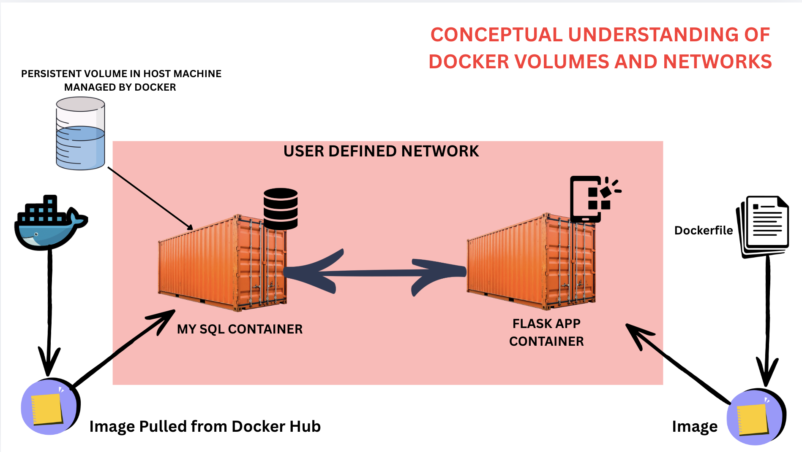
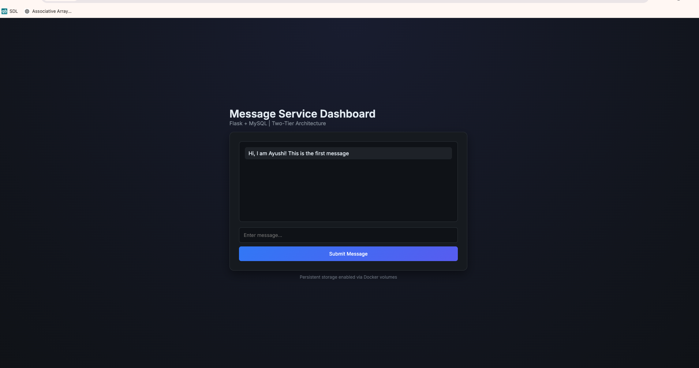
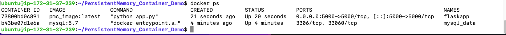
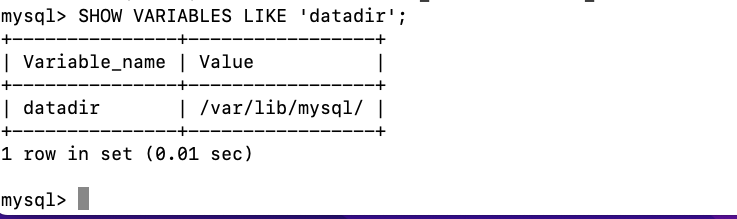

# Flask + MySQL with Docker (Volumes & Network Basics)

This project is a simple **Flask web app connected to a MySQL database**.

Users can submit messages, and those messages are stored in MySQL and displayed on the website.

---
# Conceptual Understanding 



You can also find the detailed video here: 

# What you need before starting

Make sure you have:

* Docker installed
* Git (optional)
* EC2 Server (optional)

---

# Setup (Using Docker Compose – easiest way)

## 1. Clone the project

```bash
git clone https://github.com/your-username/your-repo-name.git
cd your-repo-name
```

---

## 2. Create environment file

Create a `.env` file:

```bash
touch .env
```

---

## 3. Add database configuration

Inside `.env`:

```
MYSQL_HOST=mysql
MYSQL_USER=your_username
MYSQL_PASSWORD=your_password
MYSQL_DB=your_database
```
For demo we will be using: 

```
MYSQL_HOST=mysql
MYSQL_USER=admin
MYSQL_PASSWORD=admin 
MYSQL_DB=techwithher_db
```

👉 These values are used by the Flask app to connect to MySQL.

---

## 4. Start the application (if you are using docker compose)

```bash
docker-compose up --build
```

---

## 5. Open the app

* 🌐 Frontend: [http://localhost](http://localhost)
* 🔧 Backend: [http://localhost:5000](http://localhost:5000)

---

## 6. Create database table

Run this in MySQL:

```sql
CREATE TABLE messages (
    id INT AUTO_INCREMENT PRIMARY KEY,
    message TEXT
);
```

---

## 7. Use the app

* Go to [http://localhost](http://localhost) → submit messages
* Messages get saved in MySQL
* You can also test backend API at `/insert_sql`

---

## 8. Stop the app

```bash
docker-compose down
```

---

# Running without Docker Compose (manual way)

## 1. Build Flask image

```bash
docker build -t flaskapp .
```

---

## 2. Create Docker network

```bash
docker network create mynetwork
```

---

## 3. Start MySQL container

```bash
docker run -d \
  --name mysql \
  -v mysql-data:/var/lib/mysql \
  --network=mynetwork \
  -e MYSQL_DATABASE=mydb \
  -e MYSQL_ROOT_PASSWORD=admin \
  -p 3306:3306 \
  mysql:5.7
```

---

## 4. Start Flask container

```bash
docker run -d \
  --name flaskapp \
  --network=mynetwork \
  -e MYSQL_HOST=mysql \
  -e MYSQL_USER=root \
  -e MYSQL_PASSWORD=admin \
  -e MYSQL_DB=mydb \
  -p 5000:5000 \
  flaskapp:latest
```

---

# Important Notes (very important)

* Use same network so containers can talk (`mynetwork`)
* MySQL uses `MYSQL_*` variables for setup
* Flask uses `MYSQL_HOST`, `USER`, `PASSWORD` to connect
* Always match credentials correctly
* Use volumes (`mysql-data`) so data is not lost

---

# Common mistakes

* Using `localhost` inside containers ❌
* Username mismatch between MySQL and Flask ❌
* No shared network ❌
* No volume → data lost after restart ❌

---

# Screenshots





## 🎥 Explanation Video

[](https://www.youtube.com/watch?v=VIDEO_ID)